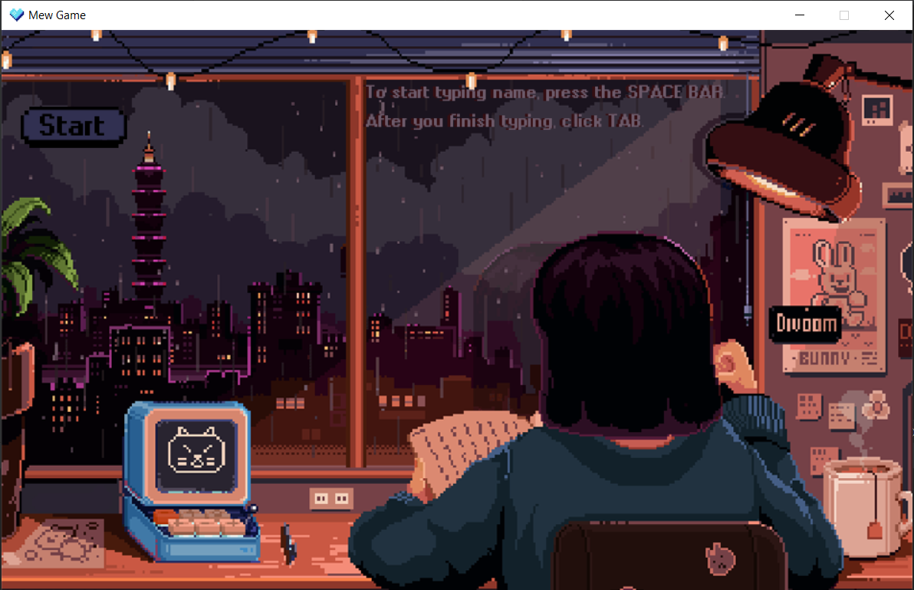
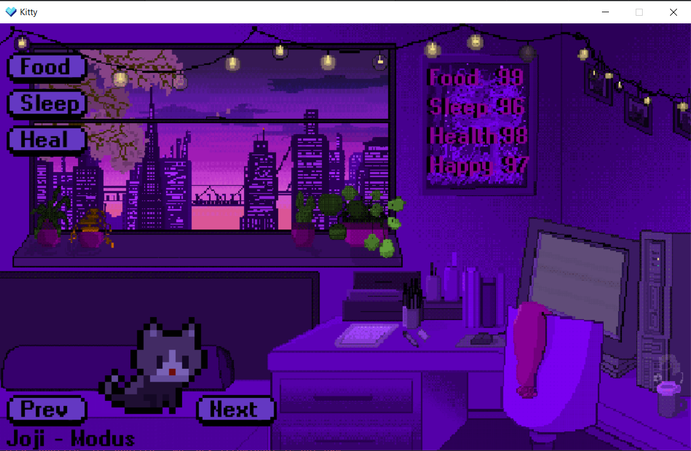
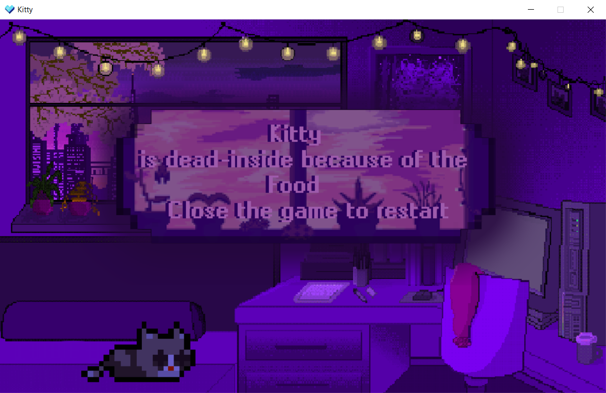

<h1 id="mew-game">MEW GAME</h1>
<blockquote>

Mew Game - симулятор котёнка (тамагочи). Вы станете обладателем прекрасного котёнка,
за которым нужно ухаживать. Главное - на забывайте про него! Ведь мы ответственны за тех, кого приручили.

<blockquote>

При запуске игры у Вас открывается меню. Нажмите на пробел и введите имя котёнка. Если вы его забыли ввести, 
то ваш котёнок будет назваться NoName. Далее нажмите кнопку Старт. У вас откроется Ваше окно с котёнком. 
Вы можете его кормить, ложить спать. Если показатели сна и еды опустятся ниже 5, то Ваш котёнок умрёт. Если вы
перекормите котёнка (показатель выше 105), ему тоже грозит смерть. Не допускайте, чтобы уровень счастья опускался ниже 5. 
Уровень счастья котёнка зависит от показателей еды и сна. Вы можете менять треки, нажимая на кнопку Next. 
Если вы случайно закрыли игру - не беда. Игра сохраняется автоматически. Запустите игру снова, 
на экране вы увидите своего любимого питомца.
Не забывайте навещать котёнка время от времени, ведь при прошествии времени он тоже теряет показатели. Если котёнок умер, то просто закройте игру. Вы можете запустить её, тогда игра начнётся сначала. 

</blockquote>
</blockquote>
<h1 id="-arncpp">Гайд по запуску Тамагочи от arncpp</h1>

<h3 id="-python-pygame-"><strong>Первый этап: установка python и pygame</strong></h3>
<h5 id="-python3-pygame-"><em>Если у вас уже установлен python3 и вы можете самостоятельно установить библиотеку pygame — пропустите этот этап</em></h5>

<strong>1. Скачайте python3 с официального <a href="https://www.python.org/downloads/">сайта</a> и установите его.</strong>
<strong>2. Во время установки <em>обязательно</em> поставьте галочку &quot;Add Python 3.x to PATH&quot;.</strong>

<strong>3. Когда установка закончится запустите консоль нажать комбинацию Win + R и в открывшемся окне вписать 
<code>cmd</code>

<strong>4. Попробуйте выполнить команду 
<code>pip</code>

если вы все сделали правильно должен вылезти список команд.

<strong>5. Установите pygame используя команду 
<code>pip install pygame</code>

<h3 id="-"><strong>Второй этап: скачивание и запуска проекта.</strong></h3>

<strong>1. Скачайте проект с github любым удобным для вас способом (gitclone или по <a href="https://github.com/arncpp/Tamagotchi-Game.git">ссылке</a>).</strong>

<strong>2. В консоли перейдите в папку с игрой при помощи команды 
<code>cd</code>

<strong>3. Запустите игру при помощи команды 
<code>python TamGame.py</code>

<h3 id="-4-"><strong>4. Наслаждайтесь!</strong></h3>

Команды, которые нужно выполнить, для запуска через консоль:

<code>pip install pygame</code>

<code>cd</code>

<code>python TamGame.py</code>

<h2 id="-pycharm">Как запустить игру на PyCharm</h2>

<strong>1. Создайте пустой проект на PyCharm: (<em>File -&gt; New Project</em>)</strong>

<strong>2. Установите библиотеку PyGame: (<em>File -&gt; Settings -&gt; Project:&quot;название&quot; -&gt; Python Interpreter -&gt; Install -&gt; pygame</em>)</strong>

<strong>3. Зайдите в убунту-консоль, перейдите в папку с проектом (с помощью cd)</strong>

<strong>4. Напишите 
<code>git clone https://github.com/arncpp/Tamagotchi-Game.git</code>

<strong>5. Подождите, пока скачается. После скачивания откройте проект в PyCharm.</strong>

<strong>6. Запустите файл TamGame.py</strong>

<h3 id="-7-"><strong>7. Играйте с котёнком, слушайте прекрасную музыку и радуйтесь жизни!</strong></h3>
<h1 id="-">Скрины из игры</h1>

<blockquote>

Здесь может быть
  Ваша реклама:)))))

</blockquote>